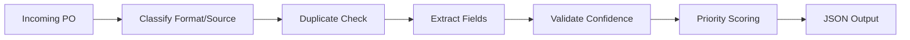

# PO Triage

## Scope (Phase 1)

- Classify incoming PO format/source
- Check duplicates
- Extract structured fields (template path + AI/OCR stub path)
- Validate extraction confidence
- Score priority using DMN-equivalent logic
- Emit JSON output for downstream automation

## Simple Flow



## Reference Diagrams

### As-Is Process


### To-Be Process


## Planned Module Layout

- `src/main.py` - JSON-first CLI entrypoint
- `src/pipeline.py` - orchestrator
- `src/classifier.py`
- `src/duplicate_checker.py`
- `src/template_extractor.py`
- `src/ai_extractor.py`
- `src/validator.py`
- `src/priority_scorer.py`

## Setup (uv)

```bash
uv sync
```

## Run

Current implementation (Step 3) runs:
- Classification (format/source)
- Duplicate check
  - Duplicate check uses a mocked Salesforce SOQL response (`existing_records`) in this PoC.
- Field extraction
  - Template path for known templates (`template_id` in known set)
  - AI/OCR stub fallback path for unknown templates

```bash
uv run python -m src.main --input sample_po.json
```

## Test

```bash
uv run python -m unittest discover -s tests -p "test_*.py"
```

Example `sample_po.json`:

```json
{
  "filename": "po_1001.pdf",
  "mime_type": "application/pdf",
  "source": "email",
  "template_id": "distributor_v1",
  "po_number": "PO-1001",
  "customer_id": "CUST-42",
  "order_total": "25000.00",
  "order_type": "renewal",
  "existing_records": [
    {
      "po_number": "PO-9999",
      "customer_id": "CUST-1"
    }
  ]
}
```
